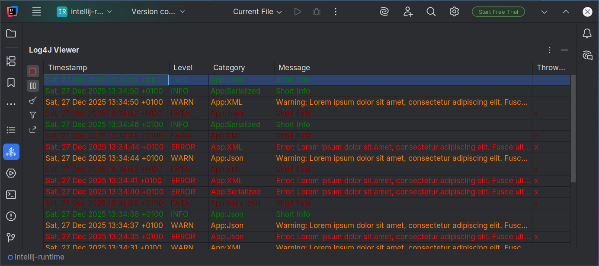
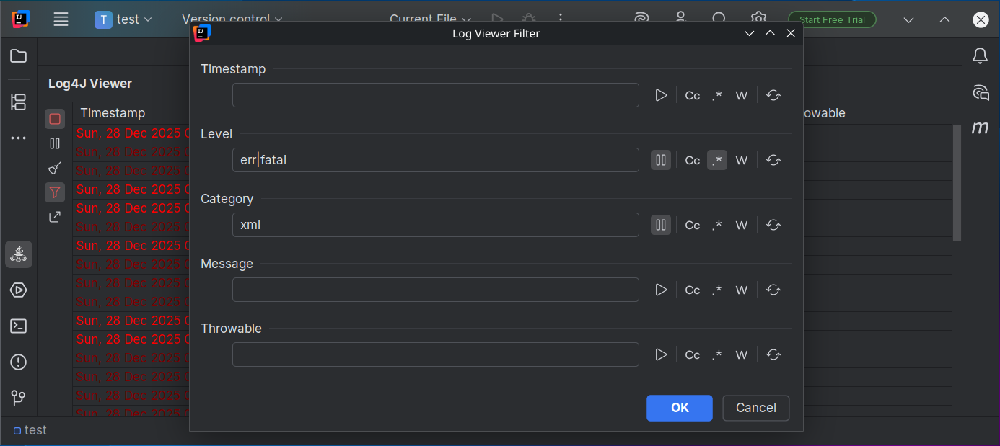
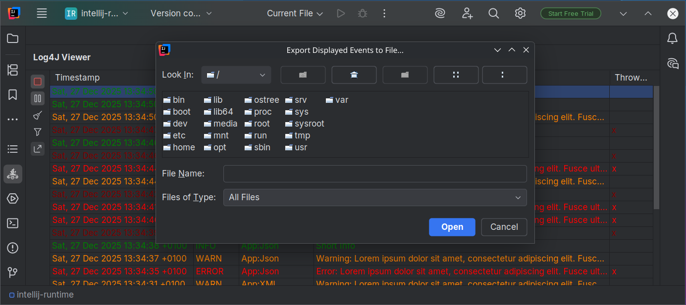
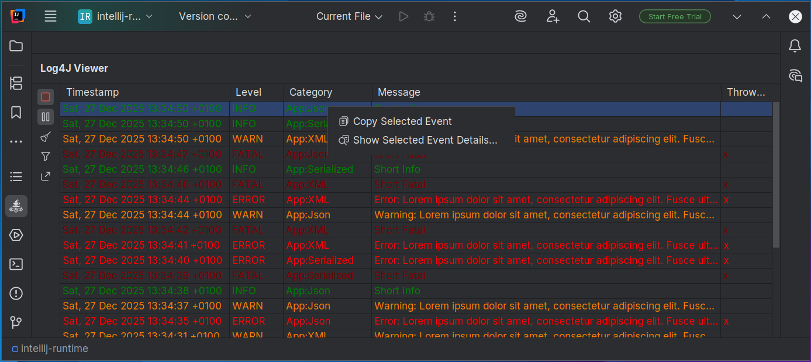
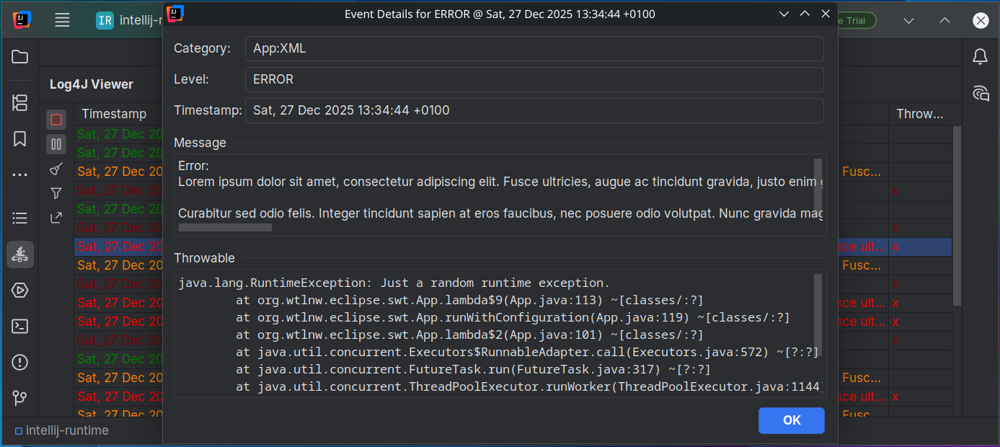
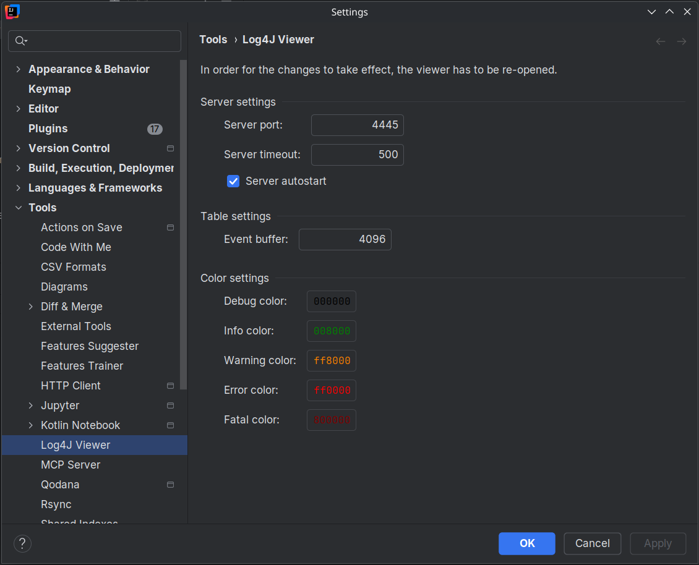

# Log4J Viewer

<!-- Plugin description -->
This plugin provides convenient functionality for software developers to capture log events generated by
[Apache Log4j 2.x](https://logging.apache.org/log4j/2.x/index.html) logging facilities and written to a [SocketAppender](https://logging.apache.org/log4j/2.x/manual/appenders/network.html#SocketAppender).
Captured events are displayed in a table allowing for 

* viewing newest events first
* displaying additional details (including stack traces)
* filtering events according to a powerful filter
* pausing user interface updates to take time analyzing event sequences
* exporting displayed events to a file in a WYSIWYG fashion for offline analysis

The current implementation supports the following layouts:

*   [SerializedLayout](https://logging.apache.org/log4j/2.x/manual/layouts.html#SerializedLayout): default, deprecated and unsafe but still widely used for development purposes
*   [XmlLayout](https://logging.apache.org/log4j/2.x/manual/layouts.html#XMLLayout): deprecated but widely used for its generic readability
*   [JsonLayout](https://logging.apache.org/log4j/2.x/manual/layouts.html#JSONLayout): deprecated but widely used for its simplicity

Although the log4j team encourages developers to switch to the more generic and extensible [JsonLayoutTemplate](https://logging.apache.org/log4j/2.x/manual/layouts.html#JSONTemplateLayout)
mechanism, there are still quite some problems to solve in order to be able to actually read its output. 
<!-- Plugin description end -->

## Installation

- Using the IDE built-in plugin system:

  <kbd>Settings/Preferences</kbd> > <kbd>Plugins</kbd> > <kbd>Marketplace</kbd> > <kbd>Search for "Log4J Viewer"</kbd> >
  <kbd>Install</kbd>

- Using JetBrains Marketplace:

  Go to [JetBrains Marketplace](https://plugins.jetbrains.com/plugin/29541-log4j-viewer) and install it by clicking the <kbd>Install to ...</kbd> button in case your IDE is running.

  You can also download the [latest release](https://plugins.jetbrains.com/plugin/29541-log4j-viewer/versions) from JetBrains Marketplace and install it manually using
  <kbd>Settings/Preferences</kbd> > <kbd>Plugins</kbd> > <kbd>⚙️</kbd> > <kbd>Install plugin from disk...</kbd>

- Manually:

  Download the [latest release](https://github.com/wtlnw/log4j-viewer-intellij/releases/latest) and install it manually using
  <kbd>Settings/Preferences</kbd> > <kbd>Plugins</kbd> > <kbd>⚙️</kbd> > <kbd>Install plugin from disk...</kbd>

## Features

Incoming log events are displayed in a special table view providing an overview over the most important event fields,
starting/stopping the event capturing, pausing table updates and clearing its contents.

It can be filtered by columns. Each column filter can then be customized just like the find/replace menu (including
regular expressions etc.).

The displayed (and potentially filtered) events can also be exported to a file for offline analysis.

The table's context menu (or a double click on selected item) provides means to view event details (including exception
stack traces).

Unfortunately, unlike its eclipse counterpart, this view does not yet provide a way to navigate directly to the source
code location by clicking on the appropriate part of the trace entry.

The view itself is limited to a fixed number of log events (configurable via preference page) so your IDE does not use
up all available memory for log intensive applications. It also takes advantage of virtual tables which improves
performance and further reduces memory usage.

---
Plugin based on the [IntelliJ Platform Plugin Template][template].

[template]: https://github.com/JetBrains/intellij-platform-plugin-template
[docs:plugin-description]: https://plugins.jetbrains.com/docs/intellij/plugin-user-experience.html#plugin-description-and-presentation
